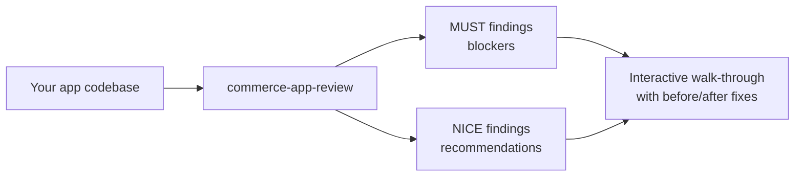

# app-review usage guide

Run this skill against your local app codebase before submitting to Adobe Exchange. It checks for security, deployment, and App Builder misconfiguration issues and walks you through each finding interactively with a concrete before/after fix drawn from your actual files.

For tool setup, see [README.md](README.md).

## Workflow



## Running the review

```
commerce-app-review
```

Run from your app's root directory. You can also pass a path explicitly (`commerce-app-review ~/my-app`) if your Claude Code session is open elsewhere.

Before the review starts, you'll be asked whether your app is **downloadable** (merchants download the source package and deploy it themselves) or **non-downloadable** (installed directly from Adobe Exchange with one click). This determines which checks apply, so the skill won't proceed until you answer.

The skill:

1. Loads team-validated patterns and exceptions from its reference library
2. Fetches the latest submission guidelines from GitHub
3. Reads all files under `APP_PATH`
4. Identifies security, deployment, and App Builder misconfiguration issues
5. Walks through findings one at a time — MUST blockers first, NICE recommendations second — pausing between each so you can ask questions or apply fixes on the spot
6. During walkthrough, enriches each finding with remediation steps and a concrete before/after fix drawn from your actual file

At the end, a summary shows how many findings were resolved during the session.

**Prerequisites:** `aio` must be authenticated (`aio login`) — it's the only external tool required. Without it the skill warns and asks whether to continue with fallback enrichment from Claude's own knowledge.

## What is reviewed

The skill checks for issues in three categories:

- **Security** — authentication, authorization, secrets exposure, CORS configuration
- **Deployment consistency** — manifest structure, App Builder configuration, documentation files, and deployment/installation artifacts when present
- **App Builder misconfiguration** — incorrect runtime settings, missing required parameters

It does **not** flag code style, naming, design patterns, or functional correctness.

## Findings format

Each finding is presented as:

```
MUST-1: <finding title>

<context — what the issue is and why it matters>

<remediation — specific steps to fix it>

<proposed fix — before/after snippet from your actual file>

<references — relevant documentation links>
```

- `MUST-<n>` — blocker. Must be resolved before the app will be approved.
- `NICE-<n>` — recommendation. Does not block approval.
