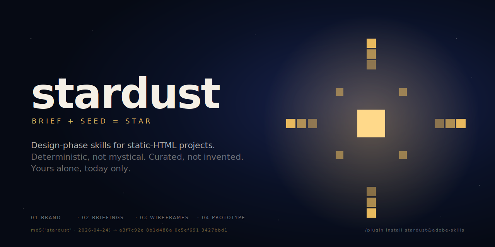
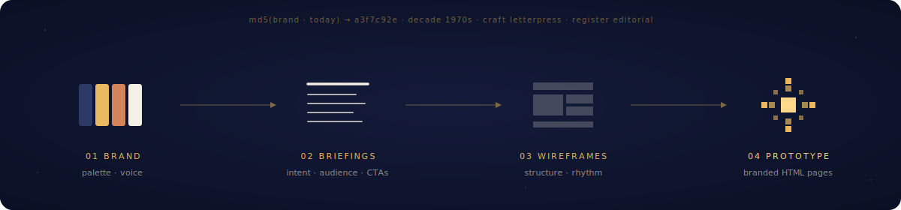

# stardust

<p align="center">
  
</p>

**Design you could only get today.**

Stardust is a design-phase toolkit for static-HTML projects. It turns a brand concept and a page brief into curated palettes, grey wireframes, and branded HTML prototypes. Platform-agnostic output — any downstream system (AEM Edge Delivery Services, another SSG, a design handoff) can consume the static files.

Every design tool promises uniqueness. Most deliver the average. Stardust adds a seed — `md5(brand · date)` — that only exists today, and only belongs to you. That seed picks from 127 real palettes, names its own clichés so it can subvert them, and produces output you literally could not receive any other way.

> Deterministic, not mystical.
> Curated, not invented.
> Yours alone, today only.

## The pipeline

<p align="center">
  
</p>

Four stages, each one skill, each owning its artifact under `stardust/`. Any order, each runnable alone.

| Skill | Owns | Invocation |
|---|---|---|
| `stardust` | Navigator — assesses `stardust/` state and recommends the next step | `/stardust` |
| `brand` | `stardust/brand-profile.json`, `stardust/brand-board.html`, `.impeccable.md` | `/stardust:brand` |
| `briefings` | `stardust/briefings/**/*.md` | `/stardust:briefings` |
| `wireframes` | `stardust/wireframes/**/*.html` | `/stardust:wireframes` |
| `prototype` | `stardust/prototypes/**/*.html` | `/stardust:prototype` |

Most of the time you won't remember slash commands — the skills activate from natural-language requests that reference `stardust/` paths.

## Install

```
/plugin install stardust@adobe-skills
```

## What makes stardust different

Three things stardust does that generic "LLM generates a brand" tools do not:

- **Palette from a curated library, not LLM-invented.** The `brand` skill's Phase 2 pauses for the designer to pick from 127 real palettes (scraped from `coolors.co/palettes/trending`, classified by deterministic HSL heuristics) filtered by the designer's description. Every chosen hex carries a source URL. See `_shared/palette-picker.md` and `_shared/palettes/`.
- **Divergence toolkit that names the LLM's own defaults.** A self-audited list of recurring moves (stencil type, hazard stripes, rotated stamps, cream grounds, triplet copy, etc.) with per-hit justification required. The toolkit caps cream at ~1/6 of runs by adding a 4th "ground family" seed dimension. See `_shared/divergence-toolkit.md`.
- **Deterministic-random seeds** from `md5(brand-name + date)` pick a decade × craft × register × ground tuple that drives visual decisions. No two brands rolled on different days collapse to the same aesthetic by accident.

## How it wants to be spoken about

If you're writing docs, onboarding, or tooling on top of stardust, keep the register honest:

- **Call it the thing.** "Palette," not "chromatic symphony." "MD5 seed," not "cosmic fingerprint."
- **Show the seed.** Every generated artifact ships with a provenance stamp. Transparency is the feature.
- **Math, not mysticism.** Say "hashed," not "inspired." Say "seeded," not "divined."
- **Honor the designer.** You are the director. Stardust is the crew. Never speak as if the tool made the design.

## Soft dependencies

`stardust` works standalone. Three peer plugins enhance it when installed:

- **superpowers** — adds `/brainstorm`, `/write-plan`, `/execute-plan`. When present, the `briefings` and `prototype` skills delegate discovery and iteration planning to it. When absent, they fall back to inline interview patterns.
- **impeccable** — adds `/impeccable critique`, `/shape`, `/teach`. When present, the `brand`, `wireframes`, and `prototype` skills delegate critique and section planning to it. When absent, they fall back to inline rubrics.
- **ai-image-generator** — present in `eds-site-builder`, `sumi`, or `testing` plugins. When installed, the `prototype` skill's Phase 0b offers real image generation (Gemini, FLUX, Imagen, DALL-E) instead of branded placeholder rectangles.

Fallbacks are viable — peer plugins are nice-to-haves, not requirements.

## AGENTS.md snippet

To reinforce activation on agents with weaker description matching, paste this into your project's `AGENTS.md`:

```markdown
## stardust

Files under `stardust/` are owned by the `stardust` skills. When asked to modify, create, or review any artifact in that folder, invoke the matching skill (`brand`, `briefings`, `wireframes`, `prototype`) instead of editing files directly.
```

## What `stardust` does NOT ship

- No downstream implementation. `stardust` stops at approved static prototypes. Converting those prototypes into EDS blocks, another framework's components, or a production CMS is a separate effort and platform-specific.

## License

Apache-2.0.

<p align="right">
  <sub><code>md5("stardust" · today)</code> — yours alone, today only.</sub>
</p>
