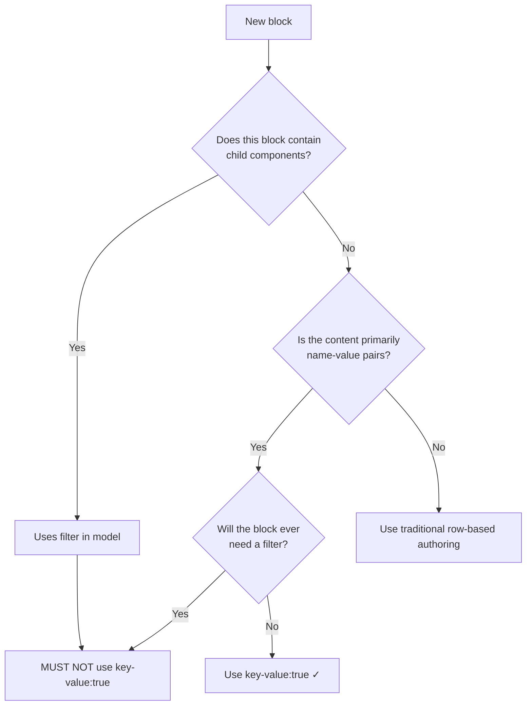

# AEM Sites Universal Editor Block Development

Structured workflow for building AEM Edge Delivery Services blocks with full AEM Sites Universal Editor (UE xwalk) integration. This skill covers the end-to-end process from content discovery through UE model registration, ensuring blocks are editable, configurable, and production-ready.

**Companion skills:**

- `building-blocks` — General AEM Edge Delivery block development patterns, JS and CSS guidelines
- `testing-blocks` — Block testing and validation workflow (linting, Playwright, browser testing)
- `content-driven-development` — Content-first development process (prerequisite)
- `block-collection-and-party` — Finding reference blocks in Adobe's block collections

**Key concepts:**

- **`moveInstrumentation`** — Transfers UE editing attributes (`data-aue-*`) when restructuring DOM
- **Key-value configuration** — Simplified authoring via `readBlockConfig()` with automatic key-value parsing
- **UE model registration** — JSON definitions that make blocks visible and editable in Universal Editor

**Non-negotiable rules (violations = broken UE editing):**

1. **Every DOM restructuring MUST call `moveInstrumentation(source, target)`** — If you create a new element to replace an authored element, transfer UE attributes. No exceptions. Missing this call silently breaks inline editing in Universal Editor.
2. **Never use `innerHTML` to replace decorated content** — It destroys all `data-aue-*` instrumentation. Use `document.createElement()` + `append()` instead.
3. **All DOM queries inside blocks MUST use `:scope` prefix** — `block.querySelectorAll(':scope > div')` not `block.querySelectorAll('div')`. Without `:scope`, selectors leak into nested blocks.
4. **Blocks with `filter` in their UE model MUST NEVER have `"key-value": true`** — Container blocks and key-value are incompatible patterns.
5. **Every block MUST have a UE model file** — No model = block renders in delivery but authors cannot edit it.

**Files per block:**

| File | Purpose |
|------|---------|
| `blocks/{name}/{name}.js` | Block decoration logic |
| `blocks/{name}/{name}.css` | Block styles |
| `models/_{name}.json` | Universal Editor model definition |

## When to Use

- Building new blocks in the `blocks/` directory
- Adding Universal Editor component definitions
- Migrating classic (document-based) blocks to xwalk (UE-enabled)
- Implementing key-value configuration patterns
- Restructuring block DOM that must preserve UE editability

**NOT for:**

- Document-based-only blocks without AEM Sites Universal Editor integration (use `building-blocks` instead)
- Non-block page-level changes (scripts.js, aem.js, delayed.js)

## Quick Reference

| Phase | Step | Action |
|-------|------|--------|
| Discovery | 0 | Content Discovery (CDD) |
| Research | 1 | Check Existing Blocks |
| Planning | 2 | Plan Block Structure + Key-Value Decision |
| Implementation | 3 | Implement Block Files |
| Styling | 4 | Add CSS Styling |
| Validation | 5 | Validate (invoke `testing-blocks` + UE checks) |
| Registration | 6 | Register in Universal Editor Models |
| Completion | 7 | Final Validation Checklist |

## Prerequisites

- **Content Discovery:** It is strongly recommended to complete the `content-driven-development` skill first. CDD establishes the content model, test content, and confirms the dev server is running.
- **Dev server running:** `npm start` (or AEM CLI equivalent)
- **Test content URL available:** A published or draft page with representative block content

---

## Step 0: Content Discovery

Invoke the `content-driven-development` skill before proceeding.

CDD establishes requirements context including:
- Test content and content model
- Test content URL for browser validation
- Confirmation that the dev server is running
- Understanding of the authoring experience and content structure

After completing CDD, continue to Step 1 with the established context.

## Step 1: Check Existing Blocks

Before building anything, check if a block already exists that does what you need.

### Search locations

1. **Project blocks** — `blocks/` directory in the current project
2. **Block collections:**
   - [AEM Block Collection (xwalk)](https://github.com/adobe-rnd/aem-block-collection-xwalk) — AEM Sites UE-enabled/xwalk blocks (preferred search starting point)
   - [AEM Boileraplte Xwalk (xwalk)](https://github.com/adobe-rnd/aem-boilerplate-xwalk) — AEM Sites UE-enabled/xwalk boilerplate 
   - [AEM Block Collection](https://www.aem.live/developer/block-collection) — Classic document-based blocks
   - [AEM Boilerplate Commerce](https://github.com/hlxsites/aem-boilerplate-commerce) — Commerce-specific blocks
   - [AEM Boilerplate XCom](https://github.com/hlxsites/aem-boilerplate-xcom) — Commerce-specitic AEM Sites UE-enabled/xwalk blocks

### Using the `block-collection-and-party` skill

Invoke the `block-collection-and-party` skill to systematically search collections. It returns matching blocks with code you can adapt.

### What to look for

- Exact matches you can use directly
- Similar blocks you can extend or adapt
- Patterns and conventions used in existing blocks (especially `moveInstrumentation` usage)

> **If a suitable block exists, adapt it rather than building from scratch.** Existing blocks encode lessons learned from previous implementations.

---

## Step 2: Plan Block Structure

Plan the block's content model, DOM structure, and configuration approach before writing code.

### 2.1 Key-Value Configuration Decision

This is the most important architectural decision. Key-value configuration changes how authors create content and how your code reads it.

#### THE CRITICAL RULE

> **Blocks with `filter` in their UE model MUST NEVER have `"key-value": true`.**
>
> Blocks that act as containers for child components use `filter` to define which children are allowed. Key-value configuration is incompatible with this pattern because it changes how the block's content rows are interpreted.

#### Decision tree



#### When to use key-value

Use key-value (`"key-value": true` in the UE model) when:

- Block content is naturally structured as labeled settings (e.g., "Title: ...", "Link: ...", "Style: ...")
- The block does NOT act as a container for child blocks
- The block will NEVER need a `filter` in its UE model
- You want simpler authoring and cleaner code via `readBlockConfig()`

#### When NOT to use key-value

- Block has or will have `filter` in its model (container blocks like sections, tabs, accordion)
- Block content is a repeating list of similar items (cards, carousels, galleries)
- Block uses rows where position/order carries semantic meaning

#### Benefits of key-value

1. **Reduced DOM complexity** — Cleaner markup, fewer wrapper elements
2. **Better performance** — Less DOM to parse and render
3. **Easier debugging** — Named properties instead of positional nth-child
4. **Simpler code** — `config.title` vs `block.querySelector(':scope > div:nth-child(3) > div')`
5. **Cleaner authoring** — Authors see labeled fields, not a grid

#### Key-value JSON syntax

In the UE model (`models/_{blockname}.json`), enable key-value:

```json
{
  "id": "example",
  "fields": [
    { "component": "text", "name": "title", "label": "Title" },
    { "component": "richtext", "name": "description", "label": "Description" }
  ],
  "key-value": true
}
```

#### Reading key-value config in JavaScript

```javascript
import { readBlockConfig } from '../../scripts/aem.js';

export default function decorate(block) {
  const config = readBlockConfig(block);
  // config.title, config.description, etc.
}
```

#### How parent/container blocks read their own settings

Parent blocks with `filter` cannot use `readBlockConfig()`. Instead, their model fields are available as `dataset` properties on the block element or as `data-aue-prop` elements in the DOM:

```javascript
// Parent block — read settings from dataset (set by UE from model fields)
export default function decorate(block) {
  const autoplay = block.dataset.autoplay === 'true';
  const interval = parseInt(block.dataset.slideInterval || '5000', 10);
  
  // Process child items (NOT config rows)
  const items = [...block.querySelectorAll(':scope > div')];
  // ...
}
```

> **Key distinction:** Leaf blocks use `readBlockConfig()` for key-value config. Parent blocks use `block.dataset.*` for their own model fields and iterate `:scope > div` children for child items.
>
> **Resource:** `resources/configuration-patterns.md` — Advanced patterns including `extractAueConfig()` for reading `data-aue-prop` elements

#### Backward-compatible fallback pattern

When migrating or when config may come from either key-value or traditional authoring:

```javascript
const title = config.title
  || block.dataset.title
  || block.querySelector(':scope > div:first-child')?.textContent?.trim()
  || 'Default Title';
```

#### Red flags for key-value decisions

| Red Flag | Why It's Wrong |
|----------|----------------|
| Adding `key-value: true` to a block with `filter` | Breaks container pattern, UE will malfunction |
| Using key-value for repeating content (cards, list items) | Key-value is for settings, not collections |
| Positional selectors (`nth-child`) in key-value blocks | Use named config properties instead |
| Not using `readBlockConfig()` in a key-value block | Defeats the purpose of key-value |

> **Resource:** `resources/field-naming-conventions.md` — Kebab-case naming rules for JSON field names. All `name` fields MUST be kebab-case or `readBlockConfig()` returns `undefined`.

### 2.2 Block structure checklist

Before implementing, document:

- [ ] Block name and purpose
- [ ] Input HTML structure (what authors create)
- [ ] Output DOM structure (after decoration)
- [ ] Configuration approach (key-value vs traditional)
- [ ] Variants needed (class-based styling variations)
- [ ] Interactive behaviors (expand/collapse, carousel, etc.)
- [ ] Child block relationships (if container block)

---

## Step 3: Implement Block Files

Create the block's JavaScript and register it for decoration.

### 3.1 Block entry point

Every block exports a default `decorate` function:

```javascript
/**
 * Decorates the block element with the final DOM structure.
 * @param {HTMLElement} block - The block element to decorate
 */
export default function decorate(block) {
  // Block implementation
}
```

### 3.2 Available utilities

Import only what you need from the project's shared scripts:

**From `../../scripts/aem.js`:**

| Utility | Purpose |
|---------|---------|
| `readBlockConfig(block)` | Parse key-value block content into a config object |
| `createOptimizedPicture(src, alt, eager, breakpoints)` | Generate responsive `<picture>` elements |
| `decorateButtons(container)` | Wrap standalone links in button styling |
| `decorateIcons(container)` | Replace `:icon-name:` spans with SVG icons |
| `toClassName(str)` | Convert string to CSS-safe class name |
| `getMetadata(name)` | Read page-level `<meta>` values |
| `loadCSS(href)` | Dynamically load a CSS file |
| `loadScript(src, attrs)` | Dynamically load a JavaScript file |
| `buildBlock(blockName, content)` | Programmatically create a block element |

**From `../../scripts/scripts.js`:**

| Utility | Purpose |
|---------|---------|
| `moveInstrumentation(from, to)` | Transfer UE `data-aue-*` attributes from source to target element |

### 3.3 `moveInstrumentation` — preserving UE editability

> **THIS IS THE #1 SOURCE OF UE BUGS.** Missing `moveInstrumentation` calls silently break inline editing. The block renders correctly in delivery but authors cannot edit it in Universal Editor. You will not see any errors — the editing UI simply won't appear.

When you restructure the DOM (move content from authored rows into a new structure), you **must** call `moveInstrumentation` to preserve Universal Editor's ability to identify and edit each content piece.

```javascript
import { moveInstrumentation } from '../../scripts/scripts.js';

export default function decorate(block) {
  const rows = [...block.children];
  block.textContent = '';

  rows.forEach((row) => {
    const card = document.createElement('div');
    card.className = 'card';
    moveInstrumentation(row, card); // Transfer UE attributes
    // ... build card content from row ...
    block.append(card);
  });
}
```

**Mandatory `moveInstrumentation` checklist — verify EVERY one of these:**

- [ ] Every `document.createElement()` that replaces an authored element has a corresponding `moveInstrumentation(original, replacement)` call
- [ ] **Every `replaceWith()` call has a preceding `moveInstrumentation(old, new)`** — `replaceWith()` removes the old element from the DOM, so you MUST transfer instrumentation BEFORE calling it
- [ ] When restructuring `<picture>` or `` elements, `moveInstrumentation(oldImg, newImg)` is called on the image
- [ ] After all DOM restructuring, no `data-aue-*` attributes were lost (verify by inspecting the rendered block)

> **The `replaceWith()` trap:** This is the second most common failure. Agents correctly identify DOM restructuring is needed, build the replacement element, call `oldElement.replaceWith(newElement)` — but forget `moveInstrumentation(oldElement, newElement)` before it. Once `replaceWith()` executes, the old element (with its `data-aue-*` attributes) is gone.

**When to call `moveInstrumentation`:**

- Every time you create a new element to replace an authored element
- **Before every `replaceWith()` call** where the old element has UE instrumentation
- When moving content from one container to another
- Whenever the original DOM node with `data-aue-*` attributes will be removed
- When wrapping elements in new containers (the wrapper needs the instrumentation)

**When NOT needed:**

- When you're only adding classes or attributes to existing elements
- When appending new elements that have no authored counterpart
- Key-value blocks that clear `block.textContent` and rebuild from config properties (the config is in `dataset`, not in DOM nodes)

### 3.4 Key-value configuration pattern

For blocks with `"key-value": true` in their UE model:

```javascript
import { readBlockConfig } from '../../scripts/aem.js';

/**
 * Decorates a key-value configured block.
 * @param {HTMLElement} block - The block element to decorate
 */
export default function decorate(block) {
  const config = readBlockConfig(block);
  block.textContent = '';

  // Build DOM from named config properties
  const heading = document.createElement('h2');
  heading.textContent = config.title;
  block.append(heading);

  if (config.description) {
    const desc = document.createElement('div');
    desc.className = 'description';
    desc.innerHTML = config.description;
    block.append(desc);
  }

  if (config.link) {
    const cta = document.createElement('a');
    cta.href = config.link;
    cta.textContent = config['link-text'] || 'Learn More';
    cta.className = 'button';
    block.append(cta);
  }
}
```

### 3.5 Traditional (row-based) configuration pattern

For blocks without key-value, content is positional:

```javascript
import { moveInstrumentation } from '../../scripts/scripts.js';
import { decorateButtons, decorateIcons } from '../../scripts/aem.js';

/**
 * Decorates a traditional row-based block.
 * @param {HTMLElement} block - The block element to decorate
 */
export default function decorate(block) {
  const rows = [...block.children];
  block.textContent = '';

  rows.forEach((row) => {
    const cols = [...row.children];
    const item = document.createElement('div');
    item.className = 'item';
    moveInstrumentation(row, item);

    // First column: image
    const picture = cols[0]?.querySelector('picture');
    if (picture) {
      const imageWrapper = document.createElement('div');
      imageWrapper.className = 'item-image';
      imageWrapper.append(picture);
      item.append(imageWrapper);
    }

    // Second column: content
    if (cols[1]) {
      const content = document.createElement('div');
      content.className = 'item-content';
      moveInstrumentation(cols[1], content);
      while (cols[1].firstChild) content.append(cols[1].firstChild);
      decorateButtons(content);
      decorateIcons(content);
      item.append(content);
    }

    block.append(item);
  });
}
```

### 3.6 Prohibited patterns

**Never use `innerHTML` to replace block content.** This is the second most common UE bug after missing `moveInstrumentation`:

```javascript
// ❌ WRONG — destroys all UE instrumentation
block.innerHTML = '';
rows.forEach((row) => {
  block.innerHTML += `<div class="card">${row.textContent}</div>`;
});

// ❌ ALSO WRONG — even building a string and assigning once destroys instrumentation
block.innerHTML = rows.map(row => `<div>${row.textContent}</div>`).join('');

// ✅ CORRECT — create elements, move content, preserve instrumentation
block.textContent = '';
rows.forEach((row) => {
  const card = document.createElement('div');
  card.className = 'card';
  moveInstrumentation(row, card);
  while (row.firstChild) card.append(row.firstChild);
  block.append(card);
});
```

**Why this matters:** `innerHTML` serializes DOM to a string, discards all objects (including `data-aue-*` attributes on child elements and any event listeners), then re-parses the string into fresh nodes. UE instrumentation is lost. `textContent = ''` only clears text nodes and children — it's safe when you've already extracted what you need from `block.children` into a variable.

### 3.7 Scope selectors

Always use `:scope` when querying within a block to avoid accidentally selecting elements from nested blocks:

```javascript
// ✅ Correct — scoped to this block
const rows = block.querySelectorAll(':scope > div');

// ❌ Wrong — may match elements in nested blocks
const rows = block.querySelectorAll('div');
```

---

## Step 4: Add CSS Styling

> **Invoke Skill:** `building-blocks` `resources/css-guidelines.md` — for full CSS conventions and design-token guidance.

Key UE-specific CSS rules:

- **Mobile-first** — Default styles for mobile, add `@media (min-width: 600px)` (tablet) and `@media (min-width: 900px)` (desktop)
- **No hard-coded `:nth-child`** — UE may insert wrapper elements that shift positions
- **Use design tokens** — `var(--body-font-family)`, `var(--text-color)`, `var(--background-color)` from `styles/styles.css`
- **Account for UE wrappers** — Target `.block-name :scope > div > div` to reach cell content safely in both delivery and editor

---

## Step 5: Validate

> Invoke the **testing-blocks** skill for comprehensive test guidance including unit tests, browser tests, and linting.

### 5.1 Lint

```bash
npm run lint
npm run lint:fix   # auto-fix what's possible
```

### 5.2 Run tests

```bash
npm test
```

### 5.3 UE-specific validation

After standard validation, verify the following Universal Editor concerns:

| Check | How to verify |
|-------|---------------|
| `data-aue-*` attributes preserved | Inspect rendered block — all `data-aue-resource`, `data-aue-type`, `data-aue-label` attributes must survive decoration |
| `moveInstrumentation` called | Every element moved or re-created from authored content must call `moveInstrumentation(source, target)` |
| UE model registered | `./models/_blockname.json` exists and is listed in a component filter |
| Editor preview works | Run `npm start`, open the page in Universal Editor, and confirm the block renders and is editable |
| Key-value config reads correctly | If using key-value, add/edit/remove a property in UE and confirm the block updates |

### 5.4 Manual editor preview

```bash
npm start
```

Open the preview URL in Universal Editor and verify:

1. Block renders correctly in the editor canvas
2. Authored content is editable (click into text, images)
3. Adding/removing rows or items works as expected
4. The properties panel shows fields defined in the model

---

## Step 6: Register in Universal Editor Models

### 6.1 Create the block model

Add `./models/_blockname.json` with three sections:

- **`definitions`** — Links block IDs to AEM resource types. Uses `core/franklin/components/block/v1/block` (parent) or `.../block/item` (child).
- **`models`** — Defines authorable fields (text, richtext, reference, select, boolean, number).
- **`filters`** — (Container blocks only) Lists which child components can be added inside.

The JSON structure follows this pattern:
```json
{
  "definitions": [{ "title": "...", "id": "block-name", "plugins": { "xwalk": { "page": { "resourceType": "core/franklin/components/block/v1/block", "template": { "name": "...", "model": "block-name" } } } } }],
  "models": [{ "id": "block-name", "fields": [{ "component": "text", "name": "title", "label": "Title", "valueType": "string" }] }]
}
```

### 6.2 Register in component filters

Add the block's definition ID to the appropriate filter in `./models/` so UE knows where the block can be placed (e.g., in the `"section"` filter for general-purpose blocks).

### 6.3 Parent/child patterns

Container blocks add `"filter": "block-name"` to their template (which references a filter definition listing allowed children). Child items use `resourceType: ".../block/item"`. See the Step 2 key-value section and `resources/configuration-patterns.md` for complete parent/child examples.

> **Resource:** `resources/blocks/example-nested-blocks/` — Complete 3-level nesting reference (Section → Block → Item) with JSON, JS, CSS, and editor-support patterns
>
> **Resource:** `resources/component-definition-organization.md` — How to organize definitions into groups and register custom sections in filters

---

## Step 7: Final Validation

Run through this checklist before considering the block complete:

- [ ] Block renders correctly in delivery (no console errors)
- [ ] Block renders and is editable in Universal Editor
- [ ] All `data-aue-*` attributes preserved through decoration
- [ ] `moveInstrumentation` called for every moved/recreated element
- [ ] UE model file exists at `./models/_blockname.json`
- [ ] Block registered in appropriate component filter
- [ ] CSS is mobile-first with proper breakpoints
- [ ] Linting passes (`npm run lint`)
- [ ] Tests pass (`npm test`)
- [ ] JSDoc present on the `decorate` function and complex helpers

---

## Red Flags

If you notice any of these patterns, stop and fix immediately:

| Red Flag | Why It Matters |
|----------|---------------|
| Missing `moveInstrumentation` calls | Elements recreated without this lose UE editability |
| Key-value config on a block with `filter` | Breaks Universal Editor child component insertion — THE CRITICAL RULE |
| Hardcoded content strings in JS | Content belongs in the document, not in code |
| No `:scope` prefix on selectors | Selectors will leak into nested blocks or other instances |
| Missing UE model file | Block will appear in delivery but won't be authorable |
| Recreating DOM without preserving `data-aue-*` attributes | Destroys UE instrumentation that enables inline editing |
| No UE preview testing | Block may work in delivery but fail in the editor |
| No responsive CSS or missing breakpoints | Block will break on mobile devices |
| Using `innerHTML` to replace decorated content | Destroys all UE instrumentation on affected elements |
| Not preserving `data-aue-*` attributes when wrapping elements | Wrapper elements must have instrumentation moved to them |
| Creating a new element to replace an authored element without `moveInstrumentation` | The #1 UE bug — inline editing silently stops working with no errors |
| Reading parent block settings with `readBlockConfig()` | Parent blocks with `filter` must use `block.dataset.*`, not `readBlockConfig()` |

---

## Common Rationalizations to Reject

| Rationalization | Reality |
|----------------|---------|
| "This block is too simple for key-value config" | Simple blocks benefit most — less DOM, cleaner code |
| "I'll add moveInstrumentation later" | Missing instrumentation causes silent UE failures. Add it during implementation. |
| "This block doesn't need a UE model" | Every authorable block needs a model. No exceptions. |
| "I'll skip checking the block collection" | Existing blocks save hours of work. Always check first. |
| "This block doesn't need variants" | Most blocks eventually need variants. Plan the class architecture now. |
| "Responsive design can come later" | Mobile-first CSS is a structural decision, not a polish step |
| "Editor preview testing is unimportant" | Most UE bugs are only visible in the editor, not delivery |
| "Key-value config is too complex for this" | Key-value is simpler — one function call vs manual DOM walking |
| "innerHTML is fine, it works in delivery" | It destroys UE instrumentation. Works in delivery ≠ works in editor |
| "I don't need moveInstrumentation here" | If you create a new element to replace an authored one, you do. Always. |
| "I'll add JSDoc later" | JSDoc is part of the implementation, not polish. Write it now. |
| "I already know how to build tabs/cards/etc." | Check the block collection first. Reference code encodes lessons learned from real implementations. |

---

## Tool Usage

### Required Commands

All project commands use `npm`:

```bash
npm run lint        # Check code style
npm run lint:fix    # Auto-fix lint issues
npm test            # Run tests
npm start           # Start local development server
```

### Validation & Testing

For comprehensive testing guidance including unit tests, browser tests, linting, and performance validation, invoke the `testing-blocks` skill:

> **Invoke Skill:** `testing-blocks` — for test strategy, what to test, and how to validate block behavior

### Documentation Search

When you need to look up AEM Edge Delivery Services documentation:

> **Invoke Skill:** `aem-docs-search` — to search aem.live documentation for features, APIs, and best practices

---

## Code Organization

### Block File Structure

Each block lives in its own directory under `blocks/`:

```
blocks/
└── block-name/
    ├── block-name.js       # Block decoration logic (REQUIRED)
    ├── block-name.css      # Block styles (REQUIRED)
    └── block-name.test.js  # Block tests (when applicable)
```

### Universal Editor Model Structure

UE models live in the `models/` directory at the project root:

```
models/
├── _blockname.json           # Individual block model definition
├── _common-blocks.json       # Shared block filter (most blocks go here)
└── _section-specific.json    # Section-specific filters (e.g., _plp-section.json)
```

### JavaScript Organization Within a Block

```javascript
/**
 * Block description.
 * @param {HTMLDivElement} block - The block element to decorate
 */
export default function decorate(block) {
  // 1. Read configuration (key-value or traditional)
  // 2. Extract and transform content from DOM
  // 3. Build new DOM structure
  // 4. Move instrumentation for UE editability
  // 5. Attach event listeners
  // 6. Handle responsive behavior
}
```

For blocks with significant helper logic, extract helpers as named functions within the same file. Only create separate utility files when logic is genuinely shared across multiple blocks.

---

## Data Passing Between Blocks

Blocks are **isolated by convention** — no custom events, global variables, or pub/sub. Six communication patterns exist: DOM attributes as shared state, `moveInstrumentation()` for UE editability, direct function imports (established patterns only), editor-support decoration replay, block isolation with `:scope` selectors, and state preservation during re-decoration.

Key rules:
- All DOM queries MUST use `:scope` selectors (e.g., `block.querySelectorAll(':scope > div')`)
- Blocks import from `scripts.js` and `aem.js` only — no cross-block imports
- Zero custom events for block communication (only RUM telemetry uses `dispatchEvent`)
- Stateful blocks use `getState()` / `setState()` pattern for UE re-decoration survival

> **Resource:** `resources/data-passing.md` — Complete data passing patterns with code examples, DOM attribute reference, editor-support event handling, and state preservation patterns

---

## Migration Guide

When migrating classic (document-based) blocks to xwalk (Universal Editor):

| Aspect | Classic | xwalk |
|--------|---------|-------|
| Content source | Google Docs / SharePoint | Universal Editor |
| Configuration | Manual DOM parsing | `readBlockConfig()` with key-value |
| Editability | Edit source doc, preview | Inline editing in UE |
| Model definition | Not needed | Required `_blockname.json` |
| Instrumentation | Not needed | `moveInstrumentation()` required |

The key transformation: add `moveInstrumentation(oldElement, newElement)` at every point where an authored element is replaced by a new element. CSS is typically identical between classic and xwalk.

> **Resource:** `resources/migration-guide.md` — Complete migration walkthrough with Cards block before/after comparison, UE model example, and transformation pattern table

---

## Troubleshooting Universal Editor Issues

For common UE integration issues including:

- Blocks not appearing in UE component picker
- Inline editing not working on specific elements
- Filter/container configuration problems
- Content not updating after edits in the editor
- Model definition validation errors

> **Resource:** `resources/ue-troubleshooting.md` — Comprehensive UE troubleshooting guide with symptoms, causes, and fixes

---

## Additional Resources

### Adobe Documentation

| Topic | URL |
|-------|-----|
| Attributes & Types | https://experienceleague.adobe.com/en/docs/experience-manager-cloud-service/content/edge-delivery/universal-editor/attributes-types |
| Component Definition | https://experienceleague.adobe.com/en/docs/experience-manager-cloud-service/content/edge-delivery/universal-editor/component-definition |
| Field Types | https://experienceleague.adobe.com/en/docs/experience-manager-cloud-service/content/edge-delivery/universal-editor/field-types |
| Publishing with Universal Editor | https://experienceleague.adobe.com/en/docs/experience-manager-cloud-service/content/edge-delivery/universal-editor/publishing |
| Universal Editor Events | https://experienceleague.adobe.com/en/docs/experience-manager-cloud-service/content/edge-delivery/universal-editor/events |
| Content Modeling for Filtering | https://experienceleague.adobe.com/en/docs/experience-manager-cloud-service/content/edge-delivery/universal-editor/content-modeling#filtering |
| Configuring Rich Text Editor | https://experienceleague.adobe.com/en/docs/experience-manager-cloud-service/content/edge-delivery/universal-editor/customizing#configuring-the-rich-text-editor |
| Customizing the Authoring Experience | https://experienceleague.adobe.com/en/docs/experience-manager-cloud-service/content/edge-delivery/universal-editor/customizing |

### Related Skills

| Skill | Purpose |
|-------|---------|
| `building-blocks` | JavaScript and CSS coding guidelines for AEM Edge Delivery blocks |
| `testing-blocks` | Testing strategies, linting, performance validation, and Playwright browser tests |
| `content-driven-development` | Content-first workflow prerequisite — run before starting block development |
| `block-collection-and-party` | Finding existing blocks in Adobe's xwalk and classic block collections |

### Key Resource Files

| Resource | Location |
|----------|----------|
| UE Troubleshooting Guide | `resources/ue-troubleshooting.md` |
| Key-Value Migration Guide | `resources/key-value-migration.md` |
| Common Mistakes Reference | `resources/common-mistakes.md` |
| Configuration Patterns | `resources/configuration-patterns.md` |
| State Management Patterns | `resources/state-management.md` |
| CSS Design Tokens | `resources/css-tokens.md` |
| Resource Loading Patterns | `resources/resource-loading.md` |
| Field Naming Conventions | `resources/field-naming-conventions.md` |
| Component Definition Organization | `resources/component-definition-organization.md` |
| Key-Value Config Example | `resources/blocks/example-key-value-config/` |
| Nested Blocks Example | `resources/blocks/example-nested-blocks/` |
